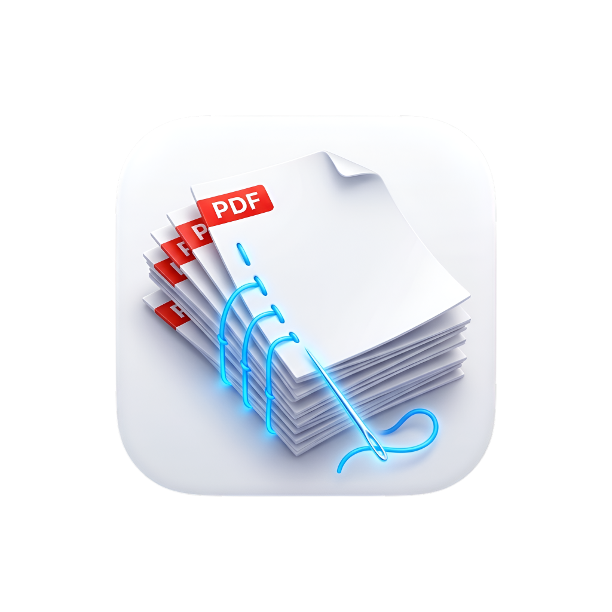

<p align="center">
  
</p>

# PDFStitch 🧵📄

**PDFStitch** is a lightweight, ultra-fast native macOS desktop application built with **Swift & SwiftUI** to combine images and PDFs, visually reorder pages via drag-and-drop or direct page jump, standardize pages to clean **A4 dimensions**, and export with smart file-size compression (e.g. Target < 9MB).

---

## ✨ Features

- **Drag & Drop Import**: Drop JPEG, PNG, HEIC, TIFF images or multi-page PDFs directly into the app.
- **Visual Reordering**: 
  - Drag thumbnail cards to rearrange page sequence.
  - Click on any page number badge to jump directly to a specific page number.
  - Right-click context menu to *Move to First (Page 1)* or *Move to Last*.
- **Standard A4 Standardization**:
  - Automatically fits and centers every image/document onto a crisp white standard A4 canvas (210 × 297 mm).
  - Supports *A4 (Standard)*, *A4 Auto (Orientation)*, and *Original Size*.
- **Smart Size & Quality Control**:
  - 🟢 **Maximum (< 5 MB)**: 72 DPI, high compression for email and chat.
  - 🔵 **Balanced (< 9 MB)**: 85 DPI, optimized for upload limits.
  - 🟣 **High Quality**: 150 DPI, crisp for reading and printing.
  - ⚪ **Original Quality**: Source resolution.
  - **Custom Slider**: Fine-tune DPI and JPEG quality.
- **Pure Native & Lightweight**: Built with pure Apple frameworks (`PDFKit`, `Quartz`, `SwiftUI`) — zero external dependencies, total binary size under 600 KB.

---

## 🛠️ Build & Run

### Prerequisites
- macOS 13.0 or later
- Xcode or Xcode Command Line Tools (`swift`)

### Run from Terminal
```bash
swift run
```

### Build `.app` Bundle
Run the packaging script to generate `PDFStitch.app` on your Desktop:
```bash
./build_app.sh
```

---

## 📜 License
MIT License
